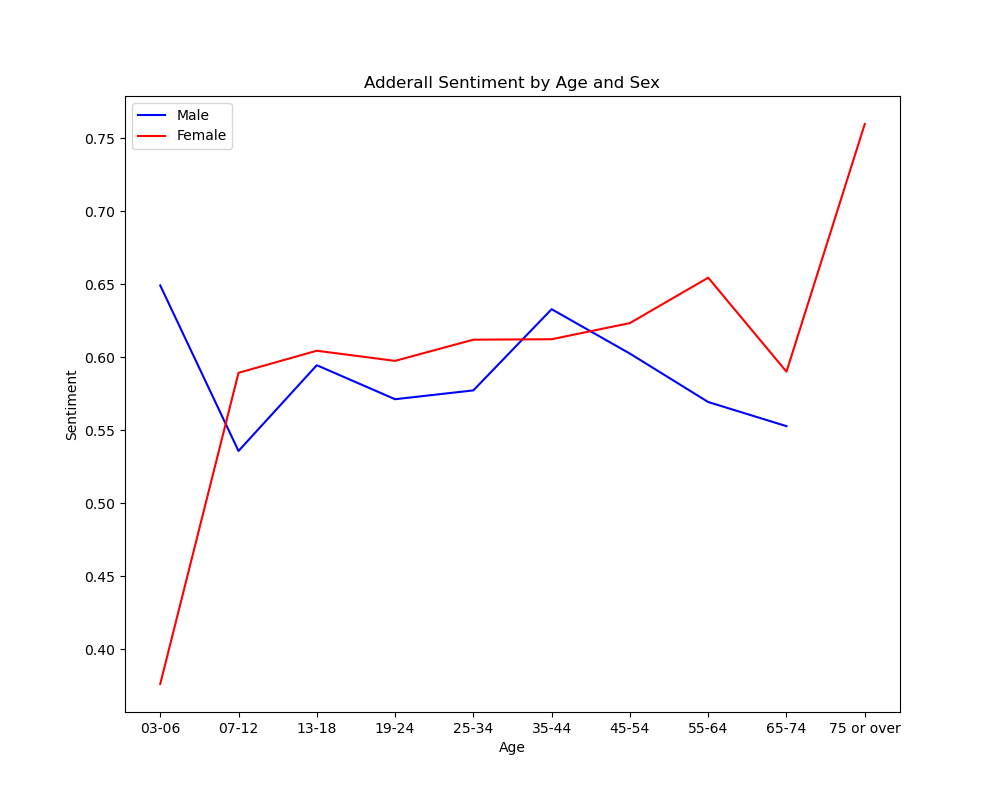
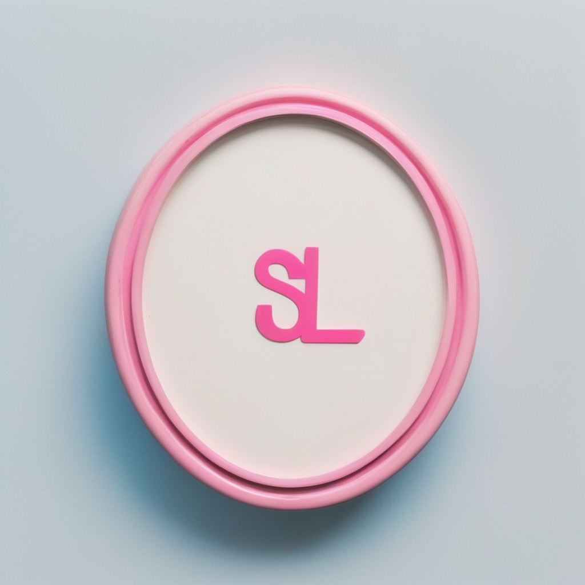
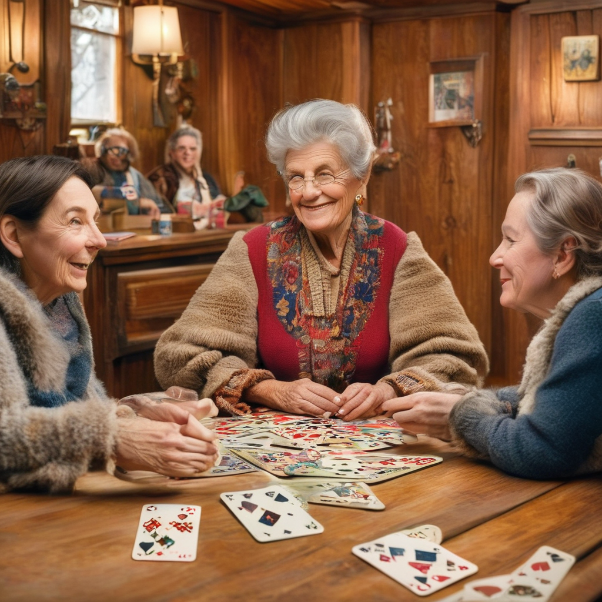
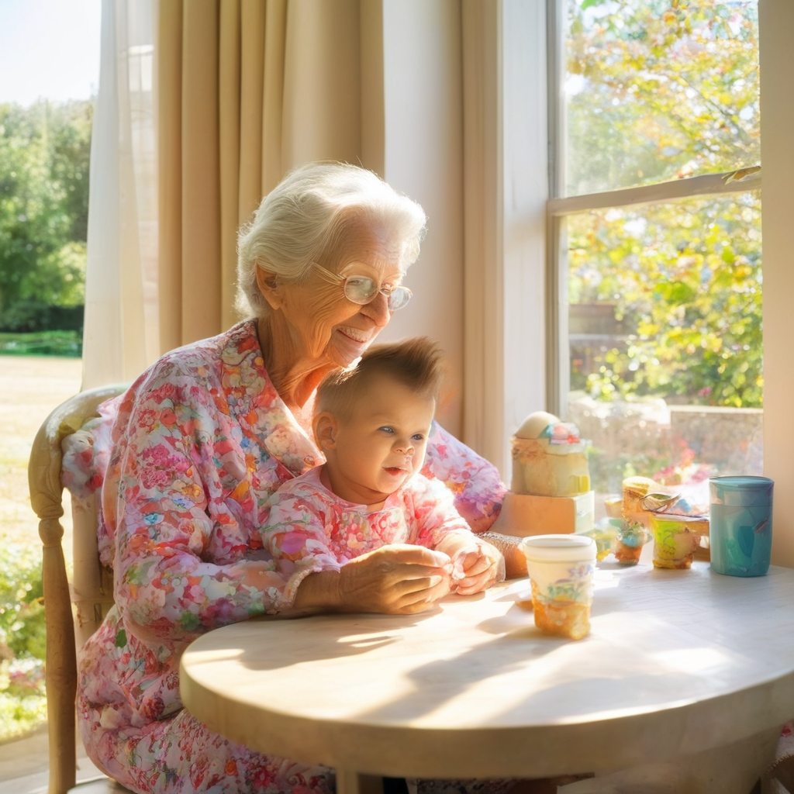
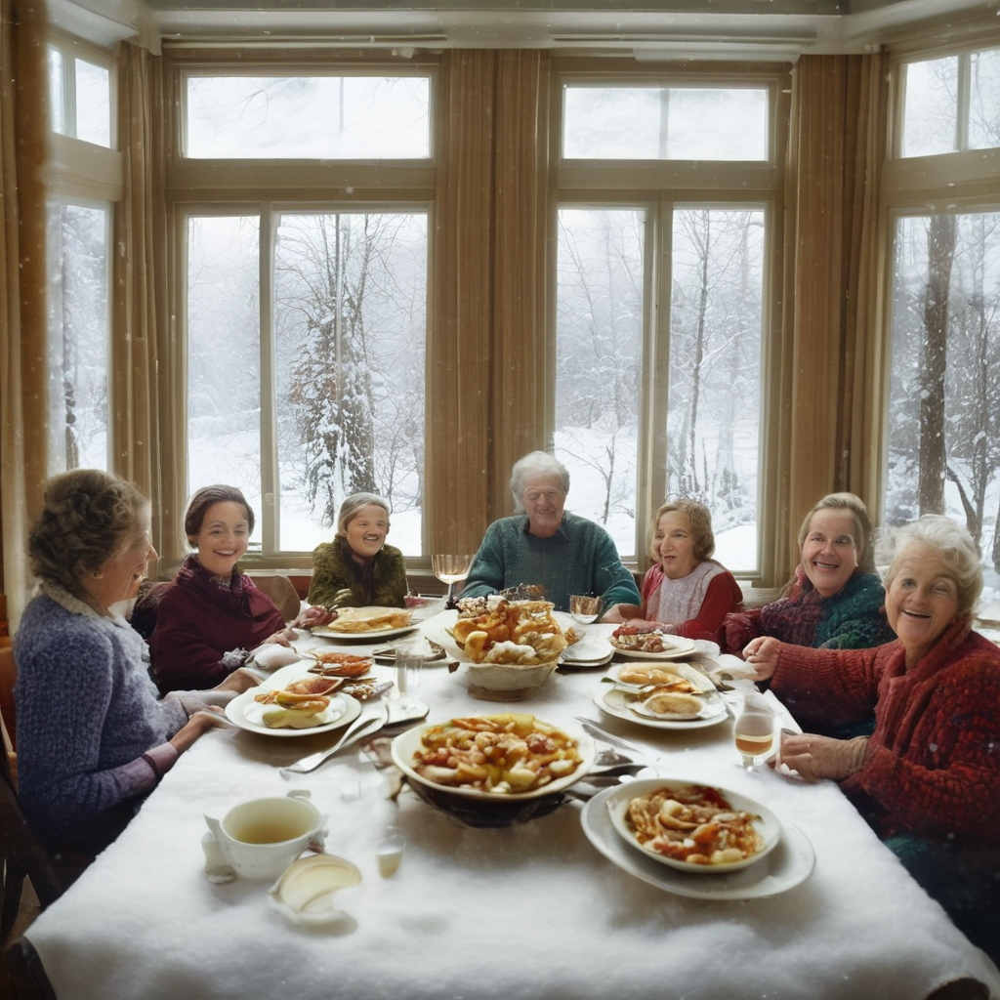

# Pharmacuetical-Research-and-Branding

## Introduction
This project analyzes medical journal articles and WebMD drug reviews of Adderall to inform potential marketing opportunities. 

## Summarization of PubMed medical journal articles
Two provided medical jornal articles relating to amphetamine were summarized using the transformer model [T5](https://huggingface.co/docs/transformers/model_doc/t5) from huggingface. One instance of output summary text is stored here: [Pubmed_Summaries](Output/Pubmed_Summaries.txt)

## Sentiment Analysis of patient reviews
500 drug reviews from WebMD were processed with [LiYuan Amazon Review Sentiment Analysis](https://huggingface.co/LiYuan/amazon-review-sentiment-analysis) from huggingface. This model is based on Amazon product reviews and can return a score based on Amazon's five-star system. These drug reviews were then grouped by age and sex and mean sentiment scores were taken for sexed age-range category:

## Analysis
Develop an analysis based on the collected data from research articles and sentiment scores. Identify strengths, weaknesses, patterns, opportunities, and threats concerning the drug's perception and market potential.

-of 62 online pharmacies examines, 92% were'rogue' ie sold drugs without valid prescription, many falsely claimed accreditation.
-the beSafeRx campaign of the food and drug administration (FDA) and the Buy Safe Rx campaign (ASOP) empower consumers by raising awareness of the dangers of purchasing medications
-amphetamine drugs have been associated with development of psychosis.

-Adderall sentiment higher among women than men across most ages by about 5%, and by far highest among women over the afe of 75 at 75%. Sentiment is next highest for 3-6 year old males at 65%. Sentiment is lowest for females 3-6 years old at below 40%.

## Branding and Marketing Materials

### Name generation
Several drug names were generated with a simple [ChatGPT prompt](https://chat.openai.com/share/8bb12d75-cbf4-47cc-aea6-dadceaacebd8):
>Prompt:
>
>I'm working on a project imagining new ways to market Adderall.  My research shows that Adderall has highest customer satisfaction among women over 75, and that there are concerns about the legitimacy of online pharmacies selling Adderall. I want a drug name that conveys a sense of reliability and safety,  conveys staying focused for enjoying time with ones family, and would appeal to women over 75.  Can you give me 10 ideas for this name?"
>
>ChatGPT:
>
>It's important to note that promoting the marketing of prescription medications involves ethical considerations, and it's crucial to adhere to regulations and guidelines set by health authorities. Additionally, creating a new drug name would fall under the purview of pharmaceutical research and development, which should be conducted by professionals in the field.
>
>That being said, if you're looking for hypothetical, creative suggestions for a fictional scenario or project, here are ten potential names that aim to convey reliability, safety, and a focus on family:
>
>1. FamilyFocusRX
>
>2. ReliaZen
>
>3. SafeguardMinds
>
>4. HarmonyAid
>
>5. Serenitall
>
>6. ClarityCare
>
>7. SecureMind Plus
>
>8. TranquilFocus
>
>9. WiseMinder
>
>10. HeartfulClarity
>
>Please remember that these names are entirely fictional, and if you are working on a real project, it's crucial to consult with professionals in the pharmaceutical and marketing fields to ensure ethical and legal practices."

For the purposes of this project, I chose "Serenitall" as a working name.

### Logo Generation

For image creation from text inputs, I used Segmind's [SSD-1B](https://huggingface.co/segmind/SSD-1B).
In their words, " The Segmind Stable Diffusion Model (SSD-1B) is a distilled 50% smaller version of the Stable Diffusion XL (SDXL), offering a 60% speedup while maintaining high-quality text-to-image generation capabilities."

I imported this model into a Google Colab notebook to have access to greater processing power and to not interfere with my local Conda environments with the several library installations and downgrades required. This notebook is saved here as [image_generation.ipynb](image_generation.ipynb). I mounted this notebook to my Google Drive and saved output images to temporary storage before manually downloading and installing them in my local repository.

I created a logo of sorts with the following prompt:
~~~
prompt = "A blue oval, containing pink letters 'STL', surrounded by a white background. 1990's aesthetic" 
neg_prompt = "complex, 3D" 
~~~
#### Generated Logo

### Marketing images
I again used SSD-1B to generate several images for potential use in marketing:

#### Image 1
~~~
prompt = "a wood paneled cozy room, an older woman with dark hair playing cards with friends " # Your prompt here
neg_prompt = "sad, dark" # Negative prompt here
image1 = pipe(prompt=prompt, negative_prompt=neg_prompt).images[0]
~~~

#### Image 2
~~~
prompt = "Grandmother at small table with child in her lap, sunny shining in the window" # Your prompt here
neg_prompt = "sad, dark" # Negative prompt here
image2 = pipe(prompt=prompt, negative_prompt=neg_prompt).images[0]
~~~

#### Image 3
~~~
prompt = "family seated around dinner table, grandmother and grandfather in center of image, snowy day outside window" # Your prompt here
neg_prompt = "sad" 
image3 = pipe(prompt=prompt, negative_prompt=neg_prompt).images[0]
~~~
